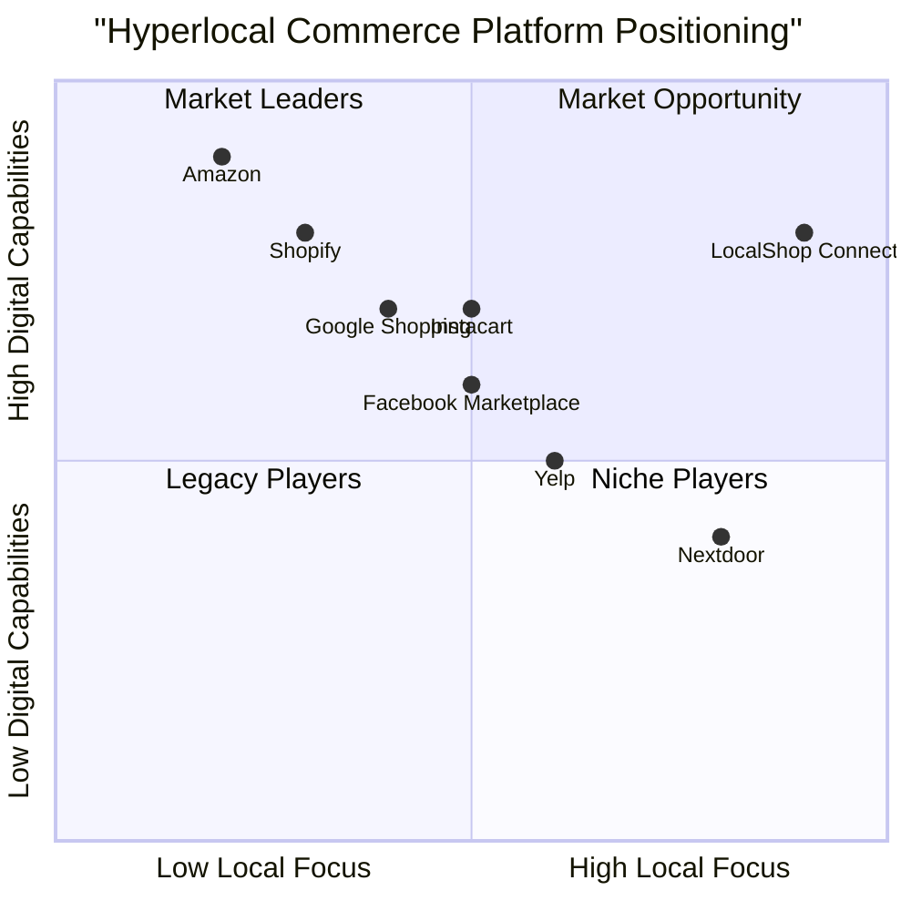

# Product Requirement Document (PRD)

## LocalShop Connect: Hyperlocal Social-Commerce Platform

### Project Overview

LocalShop Connect is a hyperlocal social-commerce platform that bridges the gap between local retailers and consumers by creating a digital ecosystem where nearby shopkeepers can showcase their products, and customers can discover, compare, and purchase items from local stores. The platform aims to revitalize local commerce by bringing neighborhood shops online while maintaining the community-oriented nature of local shopping.

### Original Requirements

A hyperlocal social-commerce platform connecting consumers with nearby shopkeepers to discover, compare, and purchase products.

#### Core Objectives
- Enable local shops to showcase products digitally
- Allow users to search for products and find real-time availability in nearby stores
- Facilitate price/feature comparisons, prebooking, and delivery options
- Foster community engagement between shoppers and local businesses

### 1. Product Definition

#### 1.1 Product Goals

1. **Digital Transformation for Local Retail**: Transform traditional brick-and-mortar stores into digitally-enabled businesses capable of competing with e-commerce giants by providing them with easy-to-use tools for online presence.

2. **Community-Centric Shopping Experience**: Create a shopping platform that preserves and enhances the community aspect of local commerce while adding digital convenience and accessibility.

3. **Data-Driven Local Commerce**: Enable data-driven decision making for local retailers through analytics and insights about customer preferences, inventory management, and market trends.

#### 1.2 User Stories

**As a Shopkeeper:**
- I want to create a digital storefront so that I can reach more customers beyond my physical location
- I want to manage my inventory in real-time so that I can prevent stockouts and overstocking
- I want to receive and fulfill orders efficiently so that I can increase sales without disrupting in-store operations
- I want access to analytics about my business performance so that I can make informed business decisions
- I want to offer promotions and discounts so that I can attract new customers and retain existing ones

**As a Customer:**
- I want to discover local shops near me so that I can support local businesses
- I want to search for products and compare prices across nearby stores so that I can make informed purchasing decisions
- I want to prebook items and schedule delivery/pickup so that I can shop conveniently
- I want to leave reviews and ratings so that I can share my shopping experience with the community
- I want to receive notifications about promotions from my favorite local shops so that I can take advantage of special offers

**As an Admin:**
- I want to verify businesses so that only legitimate shops are listed on the platform
- I want to moderate content so that the platform remains trustworthy and safe
- I want to manage disputes between shopkeepers and customers so that both parties have a positive experience
- I want to analyze platform metrics so that I can improve the platform's performance and user satisfaction

**As a Delivery Partner:**
- I want to see clear delivery instructions so that I can efficiently complete deliveries
- I want to optimize my delivery routes so that I can maximize earnings
- I want to communicate with both shopkeepers and customers so that I can resolve delivery issues promptly

#### 1.3 Competitive Analysis

| Competitor | Pros | Cons |
|------------|------|------|
| **Amazon** | Global reach, vast product selection, established logistics network, customer trust | Impersonal shopping experience, high fees for sellers, limited local focus |
| **Instacart** | Established grocery delivery service, wide coverage, strong logistics | Focused primarily on groceries, high delivery fees, limited social features |
| **Nextdoor** | Strong community focus, established user base in neighborhoods, local business listings | Limited e-commerce functionality, not focused on product discovery |
| **Yelp** | Strong review system, established business listings, search functionality | Not focused on e-commerce, limited inventory management for businesses |
| **Shopify** | Robust e-commerce tools for merchants, customizable storefronts | No hyperlocal focus, requires significant setup from merchants, no built-in customer discovery |
| **Facebook Marketplace** | Large user base, social features, community trust | Limited structured product data, basic order management, no delivery integration |
| **Google Shopping** | Powerful search, product comparison features | No social elements, limited focus on local businesses, no direct ordering system |

#### 1.4 Competitive Quadrant Chart



### 2. Technical Specifications

#### 2.1 Requirements Analysis

LocalShop Connect requires a comprehensive technical infrastructure to support its multiple stakeholders and varied functionality. The system must handle real-time inventory updates, geolocation-based search, secure payment processing, and community engagement features. The architecture needs to be scalable to accommodate growing numbers of shops and users while maintaining performance.

Key technical considerations:

- **Performance**: The platform must maintain fast loading times (under 2 seconds) for product searches and shop listings, even with high user traffic
- **Scalability**: The system should scale horizontally to support growth in user base and shop registrations
- **Security**: Robust data protection for user information and payment details is essential
- **Integration**: The platform needs to integrate with mapping services, payment gateways, and potentially delivery services
- **Offline Support**: Basic functionality should be available even with intermittent internet connections
- **Mobile Responsiveness**: All interfaces must work seamlessly across devices, with emphasis on mobile-first design

#### 2.2 Requirements Pool

**P0 - Must Have (Essential for MVP):**

*Shopkeeper Requirements:*
- Shop profile creation and management (business details, operating hours, etc.)
- Basic product catalog management (add, edit, remove products)
- Order acceptance and management
- Basic analytics (sales, popular products)

*Customer Requirements:*
- User registration and profile management
- Product search with filters (category, price range)
- Geolocation-based shop discovery
- Basic order placement (prebooking, pickup options)
- Shop and product reviews

*Admin Requirements:*
- Shop verification system
- Basic content moderation tools
- User management (suspend/ban capabilities)
- Simple dashboard for platform metrics

*Technical Requirements:*
- Responsive web application (React.js frontend)
- API backend (Node.js/Express.js)
- Database architecture (PostgreSQL for relational data, MongoDB for product catalogs)
- User authentication and authorization
- Google Maps API integration
- Basic payment gateway integration

**P1 - Should Have (Important but not critical for initial launch):**

*Shopkeeper Requirements:*
- Bulk product upload via CSV/Excel
- Promotion and discount management
- Inventory alerts
- Advanced order tracking
- Enhanced analytics dashboard

*Customer Requirements:*
- Product comparison tool
- Saved favorites and shopping lists
- Delivery tracking
- In-app notifications for order updates and promotions
- Social sharing features

*Admin Requirements:*
- Advanced content management system
- Dispute resolution system
- Marketing campaign management
- Enhanced analytics with custom reports

*Technical Requirements:*
- Real-time updates using Socket.io
- Advanced search optimization
- Performance optimization
- Enhanced security measures
- Multiple payment gateway options

**P2 - Nice to Have (Future enhancements):**

*Shopkeeper Requirements:*
- AI-powered inventory forecasting
- Customer loyalty program management
- Advanced marketing tools
- Integration with accounting software

*Customer Requirements:*
- AR product visualization
- Voice search
- Personalized recommendations
- Community forums

*Admin Requirements:*
- A/B testing tools
- Advanced fraud detection
- Business intelligence dashboard
- API for third-party integrations

*Technical Requirements:*
- Native mobile applications
- Machine learning for personalization
- Advanced caching strategies
- Microservices architecture
- Full internationalization support


#### 2.3 Frontend Architecture

**Tech Stack:**
- **Framework**: React.js with Next.js for SSR
- **State Management**: Redux Toolkit + React Query
- **Styling**: Tailwind CSS with custom theme
- **UI Components**: Custom component library with DaisyUI

**Stakeholder-specific Frontend Requirements:**

*Shopkeeper Dashboard:*
- Responsive dashboard with mobile and desktop views
- Real-time inventory management interface
- Order management system with status updates
- Analytics visualizations (charts, graphs)
- Product upload wizard with image optimization

*Customer Interface:*
- Location-aware homepage with nearby shops
- Product search with auto-suggestions
- Interactive map for shop discovery
- Product comparison tool
- Checkout flow with address management
- Review and rating system

*Admin Panel:*
- Comprehensive dashboard with platform metrics
- Moderation queue for shop approvals and content
- User management interface
- Content management system
- Analytics and reporting tools

*Delivery Interface:*
- Mobile-optimized delivery management
- Route optimization with map integration
- Order status update system
- Communication tools with customers and shops

#### 2.4 Backend Architecture

**Tech Stack:**
- **API Framework**: Node.js with Express.js
- **Database**: PostgreSQL (user data, transactions) + MongoDB (product catalog)
- **Authentication**: JWT with role-based access control
- **Cloud Services**: AWS (S3 for storage, EC2 for hosting)
- **Caching**: Redis for performance optimization

**Key APIs:**
- User API (authentication, profiles)
- Shop API (registration, management)
- Product API (catalog, search, filtering)
- Order API (placement, tracking, fulfillment)
- Payment API (integration with payment gateways)
- Analytics API (data aggregation and reporting)
- Geolocation API (shop discovery, delivery routing)

#### 2.5 Database Schema

**PostgreSQL (Relational Data):**
- Users (customers, shopkeepers, admins)
- Shops (business details)
- Orders (transactions)
- Reviews and Ratings
- Payments
- Addresses

**MongoDB (Document Data):**
- Product Catalog
- Inventory
- Search Indexes
- Analytics Data

#### 2.6 Third-party Integrations

- **Maps**: Google Maps API/Mapbox for location services
- **Payments**: Stripe/Razorpay for payment processing
- **Authentication**: OAuth providers (Google, Facebook)
- **Storage**: AWS S3 for media storage
- **Notifications**: Firebase Cloud Messaging
- **SMS**: Twilio for order confirmations and alerts
- **Email**: SendGrid for transactional emails

#### 2.7 UI Design Draft

**Shopkeeper Dashboard:**
```
+--------------------------------------------------+
|  LOGO    Dashboard | Products | Orders | Analytics|
+--------------------------------------------------+
|                                                  |
|  +-------------+  +-------------+  +------------+ |
|  | Today's     |  | Pending     |  | Low Stock  | |
|  | Orders: 12  |  | Orders: 5   |  | Items: 3   | |
|  +-------------+  +-------------+  +------------+ |
|                                                  |
|  Recent Orders                                   |
|  +------------------------------------------+   |
|  | Order #123 | $45.50 | Pending | Details > |   |
|  +------------------------------------------+   |
|  | Order #122 | $32.00 | Completed | Details >|   |
|  +------------------------------------------+   |
|                                                  |
|  Popular Products                                |
|  +------------------------------------------+   |
|  | [img] Product A | 25 units sold | $350    |   |
|  +------------------------------------------+   |
|  | [img] Product B | 18 units sold | $270    |   |
|  +------------------------------------------+   |
+--------------------------------------------------+
```

**Customer Homepage:**
```
+--------------------------------------------------+
|  LOGO    Search... [🔍]    My Account | Cart (3) |
+--------------------------------------------------+
|  [📍] Deliver to: 123 Main St                     |
+--------------------------------------------------+
|                                                  |
|  Shops Near You (within 3km)                     |
|  +-------------+  +-------------+  +------------+ |
|  | [🏪]        |  | [🏪]        |  | [🏪]        | |
|  | Shop A      |  | Shop B      |  | Shop C      | |
|  | ★★★★☆ 4.2   |  | ★★★★★ 4.8   |  | ★★★☆☆ 3.5   | |
|  | 0.8 km      |  | 1.2 km      |  | 2.5 km      | |
|  +-------------+  +-------------+  +------------+ |
|                                                  |
|  Popular Categories                              |
|  +------+  +------+  +------+  +------+  +------+ |
|  | [🍎]  |  | [🥛]  |  | [🥖]  |  | [🧹]  |  | [💊]  | |
|  | Grocery|  | Dairy |  | Bakery|  |Household|  |Pharmacy| |
|  +------+  +------+  +------+  +------+  +------+ |
|                                                  |
|  Today's Deals                                   |
|  +------------------------------------------+   |
|  | [img] Product X | Shop D | 15% OFF | $25.50 |   |
|  +------------------------------------------+   |
|  | [img] Product Y | Shop A | Buy 1 Get 1 | $12 |   |
|  +------------------------------------------+   |
+--------------------------------------------------+
```

**Admin Dashboard:**
```
+--------------------------------------------------+
|  LOGO    Dashboard | Moderation | Users | Settings|
+--------------------------------------------------+
|                                                  |
|  +-------------+  +-------------+  +------------+ |
|  | Active      |  | Pending     |  | Issues     | |
|  | Shops: 124  |  | Approvals: 8|  | Reported: 5| |
|  +-------------+  +-------------+  +------------+ |
|                                                  |
|  Platform Metrics                                |
|  +------------------------------------------+   |
|  |                                          |   |
|  |        [Graph: Daily Active Users]       |   |
|  |                                          |   |
|  +------------------------------------------+   |
|                                                  |
|  Pending Approvals                              |
|  +------------------------------------------+   |
|  | Shop XYZ | Electronics | Docs provided   | ✓ X |   |
|  +------------------------------------------+   |
|  | Shop ABC | Bakery      | Incomplete docs | ✓ X |   |
|  +------------------------------------------+   |
+--------------------------------------------------+
```

**Product Comparison:**
```
+--------------------------------------------------+
|  LOGO    Back to Search Results                   |
+--------------------------------------------------+
|                                                  |
|  Comparing: "Organic Milk 1L"                    |
|                                                  |
|  +-------------+  +-------------+  +------------+ |
|  | [img]       |  | [img]       |  | [img]       | |
|  | Shop A      |  | Shop B      |  | Shop C      | |
|  | $3.50       |  | $3.25       |  | $3.75       | |
|  | In stock: 12|  | In stock: 8 |  | In stock: 20| |
|  | Distance:   |  | Distance:   |  | Distance:   | |
|  | 0.8 km      |  | 1.2 km      |  | 2.5 km      | |
|  | Delivery: Y |  | Delivery: Y |  | Delivery: N | |
|  | Rating: ★★★★☆|  | Rating: ★★★☆☆|  | Rating: ★★★★★| |
|  |             |  |             |  |             | |
|  | [Order Now] |  | [Order Now] |  | [Order Now] | |
|  +-------------+  +-------------+  +------------+ |
|                                                  |
+--------------------------------------------------+
```

#### 2.8 Open Questions

1. **Multi-vendor Delivery Model**: Should the platform build its own delivery network, partner with existing services, or leave delivery arrangements to individual shops?

2. **Payment Split Handling**: How will the system handle payment splits between the platform, shops, and delivery partners? Will there be an escrow system?

3. **Inventory Sync**: For shops with existing POS systems, how will we handle inventory synchronization to prevent overselling?

4. **Geographic Expansion Strategy**: Should the platform launch city-by-city or target multiple regions simultaneously?

5. **Offline Mode Capabilities**: What level of offline functionality should be supported for areas with poor connectivity?

6. **User Incentives**: What loyalty program structure would best encourage repeat usage from both shopkeepers and customers?

7. **Regulatory Compliance**: How will the platform address varying regulations for different product categories (e.g., groceries vs. pharmaceuticals)?

### 3. Stakeholder Requirements

#### 3.1 Shopkeeper Requirements

**Profile & Store Management:**
- MUST be able to create and edit shop profile with business details
- MUST be able to set and update operating hours
- MUST be able to specify delivery radius and options
- SHOULD be able to customize shop appearance with logo and branding
- MAY be able to create an "About Us" section and story

**Product Management:**
- MUST be able to add individual products with details and images
- MUST be able to update product availability and pricing
- MUST be able to organize products by categories
- SHOULD be able to bulk upload products via CSV/Excel
- SHOULD receive low-stock alerts
- MAY be able to set product variants (size, color, etc.)

**Order Management:**
- MUST be able to view and respond to incoming orders
- MUST be able to update order status (accepted, preparing, ready, etc.)
- MUST be able to communicate with customers about orders
- SHOULD be able to view order history and details
- SHOULD be able to print order receipts

**Promotions & Marketing:**
- MUST be able to create basic discounts on products
- SHOULD be able to create time-limited promotions
- SHOULD be able to highlight featured products
- MAY be able to create loyalty programs

**Analytics & Insights:**
- MUST be able to view basic sales data
- SHOULD be able to see popular products and peak hours
- SHOULD be able to view customer demographics
- MAY be able to export reports

#### 3.2 Customer Requirements

**Account Management:**
- MUST be able to create and manage user profile
- MUST be able to save multiple delivery addresses
- MUST be able to view order history
- SHOULD be able to save payment methods securely

**Product Discovery:**
- MUST be able to search for products by name/category
- MUST be able to filter search results by various criteria
- MUST be able to view shops on a map based on location
- SHOULD be able to save favorite products and shops
- SHOULD receive personalized product recommendations

**Shopping Experience:**
- MUST be able to add products to cart from multiple shops
- MUST be able to view product details and availability
- MUST be able to compare prices and features across shops
- SHOULD be able to read and leave reviews
- SHOULD be able to share products with others

**Order & Fulfillment:**
- MUST be able to place orders with multiple payment options
- MUST be able to choose between delivery and pickup
- MUST be able to track order status in real-time
- SHOULD be able to schedule delivery time slots
- SHOULD be able to communicate with shops and delivery personnel

#### 3.3 Admin Requirements

**User Management:**
- MUST be able to view and manage all user accounts
- MUST be able to suspend or ban users for policy violations
- SHOULD be able to assist with account recovery

**Shop Management:**
- MUST be able to review and approve shop registrations
- MUST be able to verify business documentation
- MUST be able to monitor shop performance and compliance
- SHOULD be able to feature exemplary shops

**Content Moderation:**
- MUST be able to review flagged content (reviews, products, etc.)
- MUST be able to remove inappropriate content
- SHOULD have automated tools for content screening

**Platform Management:**
- MUST be able to configure platform settings
- MUST be able to monitor system health and performance
- MUST be able to manage commission structures and fees
- SHOULD be able to run promotional campaigns

**Support & Resolution:**
- MUST be able to handle disputes between parties
- MUST be able to process refund requests
- SHOULD be able to provide customer support

#### 3.4 Delivery Partner Requirements

**Order Management:**
- MUST be able to receive and accept delivery assignments
- MUST be able to view order details and delivery location
- MUST be able to update delivery status
- SHOULD be able to optimize delivery routes

**Communication:**
- MUST be able to contact both customers and shops
- MUST be able to report delivery issues
- SHOULD be able to provide delivery estimates

**Earnings & Performance:**
- MUST be able to track earnings and completed deliveries
- SHOULD be able to view performance metrics
- MAY be able to receive incentives for high performance


### 4. Frontend Development Requirements

#### 4.1 Technology Stack

**Core Technologies:**
- **Framework**: React.js with Next.js for server-side rendering
- **State Management**: Redux Toolkit for global state, React Query for server state
- **Styling**: Tailwind CSS with custom theme configuration
- **UI Components**: Custom component library with accessibility features

**Additional Libraries:**
- **Forms**: React Hook Form with Yup validation
- **Maps**: React Google Maps API
- **Charts**: Recharts for analytics visualizations
- **Date/Time**: date-fns for date manipulation
- **Internationalization**: i18next for multi-language support (future)

#### 4.2 Frontend Architecture

**Component Structure:**
- Atomic design methodology (atoms, molecules, organisms, templates, pages)
- Reusable component library
- Role-based layouts (Shopkeeper, Customer, Admin, Delivery)
- Lazy-loaded components for performance

**State Management:**
- Redux for global app state (authentication, cart, preferences)
- React Query for API data fetching and caching
- Context API for component-specific state

**Routing:**
- Next.js pages router with dynamic routes
- Role-based route protection
- Deep linking for sharing product/shop pages

#### 4.3 Stakeholder-Specific UI Components

**Shopkeeper UI Components:**
- Dashboard overview with key metrics
- Product management interface (CRUD operations)
- Order management system with status updates
- Inventory control panel
- Promotion creation wizard
- Analytics dashboards with visualizations

**Customer UI Components:**
- Homepage with personalized content
- Search results with filtering options
- Product cards and detailed views
- Interactive map for shop discovery
- Shopping cart with multi-shop support
- Checkout flow with address/payment handling
- Order tracking interface

**Admin UI Components:**
- Admin dashboard with platform metrics
- User management interface
- Shop approval system
- Content moderation tools
- Settings configuration panels
- Support ticket system

**Delivery UI Components:**
- Order queue with priority indicators
- Interactive map with route optimization
- Order detail view with customer/shop info
- Status update interface with photo upload
- Earnings dashboard

#### 4.4 Responsive Design Requirements

**Device Support:**
- Mobile-first approach (primary user interface)
- Tablet optimization (shopkeeper dashboard)
- Desktop support (admin panel, advanced features)

**Breakpoints:**
- xs: < 640px (mobile)
- sm: 640px - 767px (large mobile/small tablet)
- md: 768px - 1023px (tablet)
- lg: 1024px - 1279px (small desktop)
- xl: 1280px+ (large desktop)

**Layout Adaptations:**
- Collapsible navigation on mobile
- Grid adjustments for different screen sizes
- Touch-optimized controls for mobile
- Advanced features with keyboard shortcuts on desktop

#### 4.5 Performance Optimization

**Loading Strategies:**
- Lazy loading for off-screen components
- Image optimization with Next.js Image component
- Code splitting by route
- Critical CSS extraction

**Caching:**
- Service worker for offline capabilities
- In-memory caching for frequently accessed data
- Persistent storage for user preferences

**Metrics & Targets:**
- First Contentful Paint < 1.5s
- Time to Interactive < 3s
- Lighthouse performance score > 90

#### 4.6 Accessibility Requirements

- WCAG 2.1 AA compliance
- Screen reader compatibility
- Keyboard navigation
- Color contrast ratios >= 4.5:1
- Focus management for modals and dialogs
- Alt text for all images

### 5. Monetization Strategy

#### 5.1 Revenue Streams

**Subscription Model:**
- **Basic Plan** (Free): Limited product listings, standard placement, basic analytics
- **Premium Plan** ($20/month): Unlimited products, featured placement, advanced analytics
- **Business Plan** ($50/month): All premium features plus marketing tools, priority support, and lower commission rates

**Transaction Fees:**
- 5% commission on delivery orders
- 3% commission on pickup orders
- Payment processing fee (passed to customer or absorbed by shop)

**Advertising:**
- Sponsored product placements in search results
- Featured shop listings on homepage
- Banner advertisements in strategic locations
- Promoted offers in notification feeds

**Value-Added Services:**
- Enhanced analytics package: $10/month
- Professional photography service: Starting at $50
- Shop website creation: $100 setup + $10/month
- Dedicated customer support: Included in Business Plan

#### 5.2 Pricing Strategy

**For Shopkeepers:**
- Tiered subscription model with clear value proposition
- Commission structure that incentivizes platform use
- Volume discounts for high transaction shops
- Early adopter discounts to build initial marketplace

**For Customers:**
- Free to use (no subscription fee)
- Transparent display of delivery fees
- Optional premium membership with free delivery and exclusive offers ($5.99/month)

#### 5.3 Growth Strategies

**New Shop Acquisition:**
- "First 3 months free" promotion for new shops
- Referral bonuses for shop-to-shop recommendations
- Community workshops and onboarding assistance

**Customer Acquisition:**
- First order discount ($5 off)
- Referral program ($5 credit for each new customer)
- Loyalty points program

**Retention Strategies:**
- Personalized promotions based on shopping history
- Exclusive flash sales for active users
- Community engagement through local events


### 6. Legal & Security Considerations

#### 6.1 Compliance Requirements

**Data Privacy:**
- GDPR compliance for EU users
- CCPA compliance for California users
- Data minimization and purpose limitation
- User consent management
- Data subject access request handling

**E-commerce Regulations:**
- Digital receipts and invoicing
- Consumer protection policies
- Return and refund policies
- Product liability disclaimers
- Terms of service and user agreements

**Financial Compliance:**
- PCI DSS compliance for payment processing
- Anti-money laundering (AML) checks
- KYC (Know Your Customer) for shop verification
- Tax calculation and reporting

#### 6.2 Security Measures

**User Data Protection:**
- End-to-end encryption for sensitive data
- Secure password hashing (bcrypt)
- Multi-factor authentication option
- Regular security audits and penetration testing

**Transaction Security:**
- SSL/TLS encryption for all connections
- Tokenization for payment information
- Fraud detection algorithms
- IP-based anomaly detection

**Infrastructure Security:**
- Regular vulnerability assessments
- AWS security best practices
- Database encryption at rest
- Rate limiting to prevent abuse

#### 6.3 Content Moderation

**Prohibited Content:**
- Illegal products or services
- Counterfeit goods
- Age-restricted items without verification
- Misleading product descriptions

**Review Moderation:**
- AI-assisted detection of fake reviews
- Guidelines for acceptable review content
- Dispute process for contested reviews
- Verified purchase badges

#### 6.4 Dispute Resolution

**Customer-Shop Disputes:**
- Structured resolution process
- Escrow system for payment protection
- Platform mediation for unresolved issues
- Clear refund and return policies

**Platform Policies:**
- Code of conduct for all users
- Shop quality standards
- Service level agreements
- Account suspension and termination criteria

### 7. Development Roadmap

#### 7.1 Phase 1: MVP (3 Months)

**Core Features:**
- Shop and user registration/authentication
- Basic shop profiles and product management
- Location-based shop discovery
- Simple product search and filtering
- Basic order placement and management
- Shop verification system
- Payment integration (single provider)

**Technical Focus:**
- Frontend and backend core infrastructure
- Database design and implementation
- Maps integration for location services
- Basic payment gateway integration
- Essential security features

**Launch Strategy:**
- Soft launch in selected neighborhoods
- Onboard initial set of 50-100 local shops
- Limited marketing to attract early adopters

#### 7.2 Phase 2: Core Platform Enhancement (3-6 Months)

**Feature Enhancements:**
- Product comparison tool
- Advanced search with filters
- Promotion and discount system
- Enhanced shop analytics
- Delivery integration options
- Ratings and reviews system
- Bulk product upload

**Technical Improvements:**
- Performance optimization
- Enhanced security measures
- Real-time notifications
- Additional payment options
- Improved search algorithms

**Growth Strategy:**
- Expand to additional neighborhoods
- Launch referral programs
- Marketing campaigns targeting specific user segments
- Partnerships with local business associations

#### 7.3 Phase 3: Advanced Features & Expansion (6-12 Months)

**Advanced Features:**
- Community forums and social features
- Personalized recommendations
- Advanced analytics and business insights
- Loyalty programs and rewards
- Multi-vendor delivery optimization
- Mobile application (React Native)

**Technical Advancements:**
- Machine learning for product recommendations
- Advanced caching and performance improvements
- Business intelligence dashboard
- API for third-party integrations
- Scale infrastructure for increased traffic

**Expansion Plans:**
- Launch in additional cities
- Strategic partnerships with larger retail chains
- Additional revenue streams activation
- International market assessment

#### 7.4 Success Metrics

**Platform Growth:**
- Number of active shops (target: 500+ in first year)
- User acquisition (target: 10,000+ in first year)
- Monthly active users (target: 40% retention)
- Geographic coverage (target: 10+ neighborhoods in first city)

**Engagement Metrics:**
- Average orders per user per month
- Shop visits to purchase conversion rate
- User session time and frequency
- Review submission rate

**Business Metrics:**
- Total transaction volume
- Average order value
- Revenue from commissions
- Revenue from subscription plans
- Customer acquisition cost
- Customer lifetime value

### 8. Conclusion

LocalShop Connect aims to transform local commerce by bridging the gap between digital convenience and community-centered shopping. By providing shopkeepers with accessible tools to establish an online presence and giving customers a convenient way to discover and purchase from local businesses, the platform addresses the growing demand for supporting local economies while meeting digital expectations.

This PRD outlines a comprehensive roadmap for building a scalable, feature-rich platform that serves multiple stakeholders: shopkeepers, customers, administrators, and delivery partners. The phased approach allows for iterative development and feedback incorporation, ensuring that the final product meets market needs and achieves product-market fit.

Success will be measured not only by business metrics but also by the impact on local communities – revitalizing neighborhood shops, creating digital opportunities for traditional businesses, and fostering stronger connections between consumers and local retailers.

The technical architecture is designed for scalability, allowing the platform to expand geographically and functionally as adoption grows. By focusing initially on core features while planning for future enhancements, LocalShop Connect can establish a strong foundation while remaining adaptable to evolving market needs and technological advancements.
